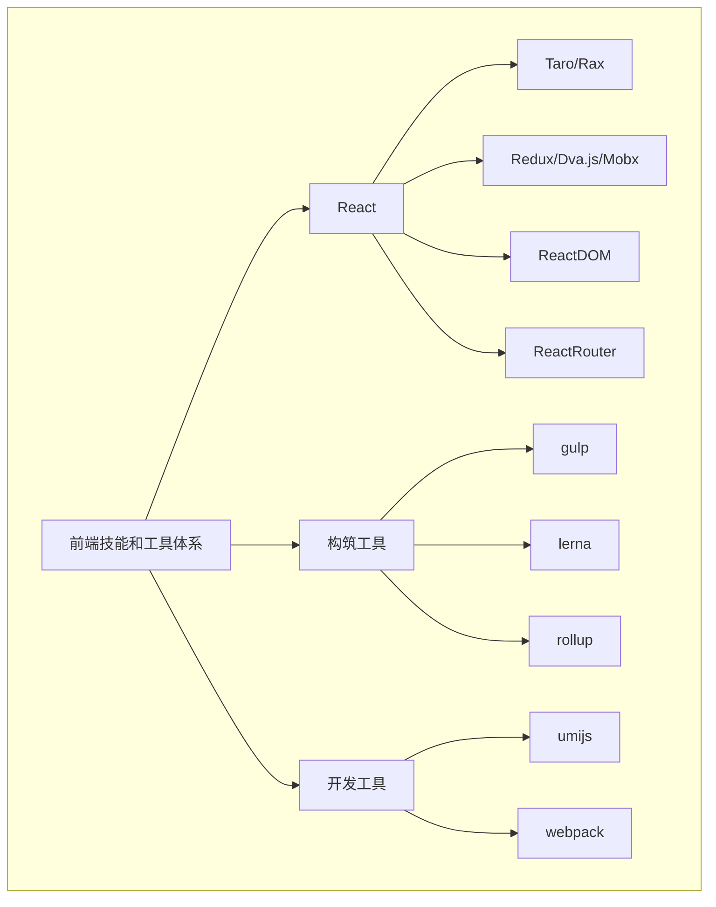
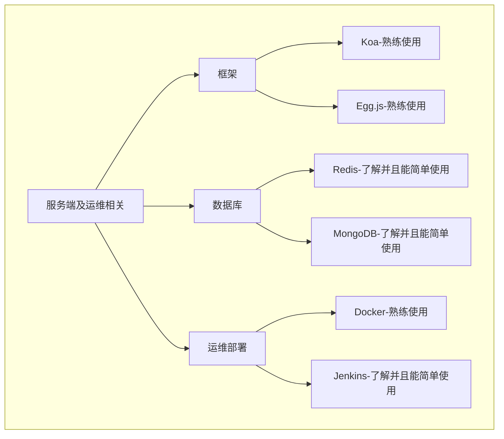

import ProfessionBlock from "../src/elements/ProfessionBlock";

<h2 align="center">About Me</h2>

  
  <a style={{display:"block",paddingBottom:20}}>扫码查看网页版</a>

  
  
  

  

    电话(微信):<a href="tel:18058173171">180 5817 3171</a>
  

  

    邮箱(QQ):<a href="mail:1542874601@qq.com">1542874601@qq.com</a>
  

你好,我叫 俞士成 是一名JavaScript开发者,我从2018年开始进入到前端开发行业,目前已经有 三年 的前端工作经验,
之前也做过一年的UI设计,在从事UI设计的那段时间我觉得我对开发行业的认知并不全面,很多设计思想无法跟开发人员达成一致,
这时我意识到自己对开发其实一无所知,所以我选择了转行,在这期间我为了深入了解软件开发和互联网行业,自学了JavaScript相关的知识和技能,
在从业期间我提升了自己的学历和技能,小到金涛珠宝这样的创业公司,大到国铁吉迅这样的技术生态完善的公司,
我了解并感受到了敏捷开发的魅力和过程,并且自己独立开发了不少的项目,我觉得我可以结合敏捷开发的核心理念和开发经验
为公司的开发团队创造更多的价值,我会围绕敏捷开发为核心,在完成项目的同时为公司的开发团队提供相关的技术生态,
在过去的一年中我在亦友教育担任了全栈工程师的角色,主要也是对技术生态这块进行了实践,
同时全栈工程师的角色也让我对 敏捷开发 又有了更全面的理解,所以我认为我有一定的 前端架构能力, 解决问题的能力 和 项目设计的能力,
可以胜任前端架构师的工作。

<h2 align="center">求职方向</h2>

  <ProfessionBlock>前端开发</ProfessionBlock>
  <ProfessionBlock>全栈工程师</ProfessionBlock>
  <ProfessionBlock>前端架构师</ProfessionBlock>

<h2 align="center">我使用的技术和工具体系</h2>

  
  
  
  
  
  

<h2 align="center">简单的自我评价</h2>

在项目组中我比较擅长构建技术生态,致力于实现规范化,系统化,插件化,自动化,
从而在团队中打造一定的影响力,早期的从业经验告诉我,一个项目的成功与否不仅仅是由项目的参与者决定的,
需要有完善的开发生态,这些生态包括了 `npm包生态`, `cli工具链生态` 以及 `组件库` 和 `可视化开发工具` ,
只有在开发的过程中完善好这些工具及周边生态,开发项目时的条条框框和细节才可以得到规范,
并且保证了在项目人员流转的同时开发经验也可以得到集成,也就是说,有了这些生态节点,
项目的成功是可以被复刻的,同时项目也是可以被继承的,所以我在团队中的定位就是项目生态的打造者和领导者,是一个类似于园丁的角色.
