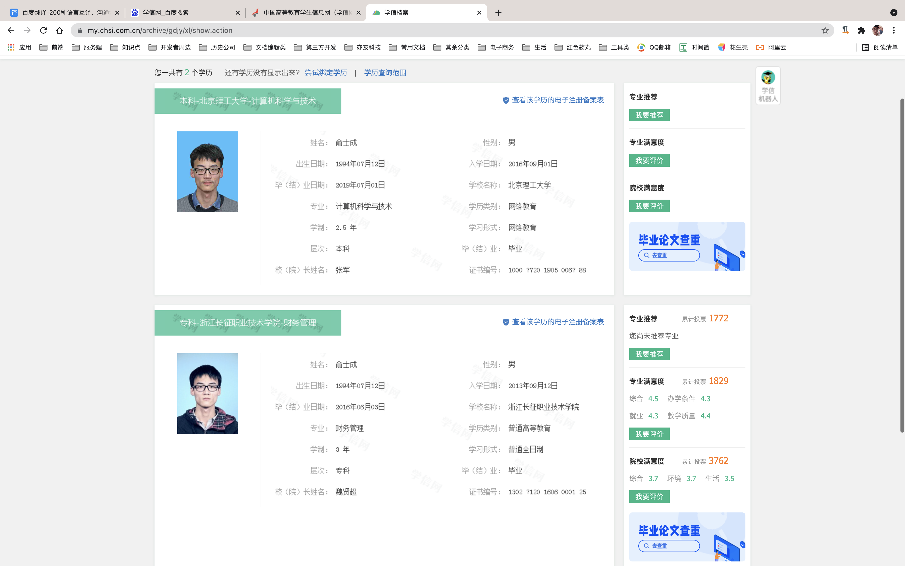

# 自我介绍

<h2 align="center">前端开发工程师-俞士成</h2>

  
  
  

  

    电话(微信):<a href="tel:18058173171">180 5817 3171</a>
  

  

    邮箱(QQ):<a href="mail:1542874601@qq.com">1542874601@qq.com</a>
  

<h2 align="center">自我技能总结</h2>

- 使用umijs,react,dva.js,mobx,webpack技术栈开发web应用;
- 使用lerna和yarn进行项目生态建设,包括npm包生态,cli工具链生态以及组件库
- 使用egg和koa技术栈打造项目微服务生态;
- 使用docker进行项目的集成交付;

  
  
  
  
  
  

<h2 align="center">我的技术社区</h2>

| 名称       | 链接                              |
| ---------- | --------------------------------- |
| gitee码云  | https://gitee.com/kdzs493         |
| github社区 | https://github.com/yushicheng     |
| npm社区    | https://www.npmjs.com/~yushicheng |

<h2 align="center">自我评价</h2>

我是一个使用nodejs的全栈开发者早期从事过ui设计和web前端开发,在项目组中我比较擅长构建技术生态,致力于实现规范化,系统化,插件化,自动化,从而在团队中打造一定的影响力,早期的从业经验告诉我,一个项目的成功与否不仅仅是由项目的参与者决定的,需要有完善的开发生态,这些生态包括了 `npm包生态`, `cli工具链生态` 以及 `组件库` 和 `可视化开发工具` ,只有在开发的过程中完善好这些工具及周边生态,开发项目时的条条框框和细节才可以得到规范,并且保证了在项目人员流转的同时开发经验也可以得到集成,也就是说,有了这些生态节点,项目的成功是可以被复刻的,同时项目也是可以被继承的,所以我在团队中的定位就是项目生态的打造者和领导者,是一个类似于园丁的角色.

  

# 金涛珠宝-项目经历

> #### [杭州金涛珠宝有限公司](https://www.tianyancha.com/company/1345128050)
>

- **工作时间：**2018/03~2019/04
- **核心技术栈：**`React`,`webpack`,`koa`,`mobx`
- **项目企划：**金钻客微聊系统是杭州甄钻珠宝有限公司针对珠宝零售行业提供的新的解决方案，主要用于员工和客户沟通,客户信息管理和需求跟踪。系统拥有人脸识别,云服务和扫码关注功能，操作更简单,使用更方便,管理更齐全。
- **功能简介：**完成设计师个人主页作品的上传，修改。与公众号高端定制入口的功能的聊天功能，以及个人主页的编辑功能，该项目用于管理珠宝款式设计师的作品，与微信公众号高端定制页面
- **主要职责：**负责前端页面的构筑，使用ajax技术和asp.net服务端进行数据交互，使用react和react-dom渲染前端页面，使用jsBridge技术和安卓端进行数据交互，使用ajax轮询技术实现在线聊天功能，使用mobx架构来管理数据抽象层和控制异步业务流程

| 项目名称                                           | 核心功能                                                     | 项目类型 |
| -------------------------------------------------- | ------------------------------------------------------------ | -------- |
| [金钻客商家H5客户端](http://jzker.cn)              | 读取智能设备录入的访客信息，并对信息进行编辑和修改，通过建立客户端与微信公众号的匿名聊天对访客进行消息推送。通过员工模块管理员工信息。 | h5项目   |
| [金钻客设计师H5客户端](http://h5designer.jzker.cn) | 建立设计师端和访客端的聊天功能。上传设计图，编辑设计师信息。 | h5项目   |
# 国铁吉迅-项目经历

> #### [国铁吉迅科技有限公司](https://www.tianyancha.com/company/3208361333)
>

- **工作时间：**2019-04~2020-06
- **核心技术栈：**`umi.js` `egg.js` `mongose` `cli`
- **主要职责**：使用umi.js开发各大中后台web界面，使用egg.js和mongose开发后台服务，使用cli相关工具(ora,commander,ini等)开发命令行辅助脚本,开发行程业务线的活动页面

- [这是我在国铁吉迅的工作内容](https://t-static.ccrgt.com/shichenyu_work_detail/)

| 项目名称                                                     | 核心功能                                                     | 项目类型             |
| ------------------------------------------------------------ | ------------------------------------------------------------ | -------------------- |
| [@cyber-tools/tinify](https://www.npmjs.com/package/@cyber-tools/tinify) | 基于[tinipng](https://tinypng.com/developers/reference/nodejs)的openAPI 该工具用于批量压缩项目中的图片文件 | cli工具库            |
| [@cyber-tools/cyber-cdn](https://www.npmjs.com/package/@cyber-tools/cyber-cdn) | 基于[腾讯云的openAPI](https://cloud.tencent.com/document/sdk/Node.js)开发 该工具的主要功能是将项目的图片上传到腾讯云并且在原目录下形成一个json记录 | cli工具库            |
| [@cyber-tools/cyber-order](https://www.npmjs.com/package/@cyber-tools/cyber-order) | 这是做项目的时候使用的简易脚本,其中包含npm相关的脚本和封装后的git命令 | cli工具库            |
| [国铁出行行程年报](https://static.ccrgt.com/FE-TRIP-REPORT)  | 国铁出行小程序和客户端的活动页面，通过截图分享用户的行程数据来进行推广 | h5活动页             |
| [国铁出行wifi线下推广活动页](https://t-static.ccrgt.com/FE-WIFI-CHANNEL-TEMPLATE/#/IndexPage/CodePage?channelId=36967194099497644154&channelLevel=3&parentChannelId=26971465301183262842) | 用于推广国铁出行的扫码拉新活动，该活动长期有效               | h5活动页             |
| [坐高铁去旅行](https://t-static.ccrgt.com/FE-SUMMER-TRAVEL)  | 国铁出行小程序和客户端的出游基金活动                         | h5活动页             |
| [车厢信息展示](https://t-static.ccrgt.com/FE-CARRIAGE-INFO)  | 依附于国铁出行小程序和客户端的车厢信息的内置html5页面,主要用于展示用户当前行程的所属的车厢数据 | 应用内置的h5页面     |
| [国铁出行小程序二维码管理服务](https://t-static.ccrgt.com/matrix2/#/miniProgramQRCode/QRCodeManage/QRCodeList) | 用于管理国铁出行小程序二维码(活动二维码,分享二维码等)的服务  | nodejs和前端综合项目 |
| [上海虹桥车站小程序管理后台](https://t-static.ccrgt.com/matrix2/#/stationManage/UserFeedback) | 用于管理全国各大车站的基础业务如:失物找回,公告管理,旅客预约等 | h5中后台项目         |
| [国铁出行app推荐模型配置平台](https://t-static.ccrgt.com/matrix2/#/applicationConfig/IndexWonderfulConfig/WonderfulConfigList) | 基于大数据配置客户端的推荐模型                               | h5中后台项目         |
| [红帽子车站托运业务管理后台](https://t-static.ccrgt.com/redHatManage/#/redHatManage/GeneralView) | 用于调配和管理全国各大车站的“红帽子托运服务”                 | h5中后台项目         |
| [掌上高铁营销中心](https://t-static.ccrgt.com/matrix2/#/marketingCenter) | 用于配置“掌上高铁”客户端的优惠券模型和券模板管理             | h5中后台项目         |
# 亦友教育-项目经历

> #### [亦友教育](https://yi-you.org/)

- **工作时间：**2020-12~2021-09
- **核心技术栈：**`umi.js` `egg.js` `redis` `lerna` `gulp` `docusaurus` `electron`
- **主要职责：**以全栈工程师的身份开发亦友教育的白板项目,使用lerna和yarn打造白板项目生态,使用koa;eggjs和docker构筑和部署微服务,使用electron开发客户端

- [白板主项目请点击这里查看](http://git.yiyoujiaoyu.com.cn/node-group/yiyou-write-borad/-/blob/master/README.md)
- [白板客户端项目请点击这里查看](http://git.yiyoujiaoyu.com.cn/node-group/yiyou-pano-electron/-/blob/master/README.md)
- [我在亦友教育的其他工作内容](https://yiyou-education.github.io/white-board-docs-website/)

> #### 项目心得简述

在最近这份工作中,开发生态这个概念也得到了一个好的验证和反馈,
由于公司项目是基于[拍乐云第三方技术服务](https://www.pano.video/)进行开发的,涉及到跨项目组的交流和协作虽然前期的开发由我完成但后期的维护并不止我一个人,所以保持开发程序在不同项目组中的一致性这个问题就变的格外的重要.

项目开发和协作过程中保持一致性的关键点如下

- cli工具链生态
- npm包生态
- 组件库生态
- 子应用模块生态

#### cli工具链

> 辅助开发的命令行工具保证了开发中操作的一致性

| 工具名                                                       | 命名功能描述                                                 |
| ------------------------------------------------------------ | ------------------------------------------------------------ |
| [@yiyou/server-host](http://git.yiyoujiaoyu.com.cn/yiyou-basic/server-host) | 根据云端配置选择全局的接口域名(可以在dockerfile中搭配RUN关键字使用根据环境变量切换容器接口域名) |
| [@yiyou/user-account](http://git.yiyoujiaoyu.com.cn/yiyou-basic/user-account) | 根据云端配置选择参与开发的账号信息(教师角色,学生角色,家长角色) |
| [@yiyou/class-action](http://git.yiyoujiaoyu.com.cn/tool-group/class-action) | 在运行开发命令之前进行排课,并且将课堂信息以json形式生成到当前目录下 |
| [@yiyou/deploy-action](http://git.yiyoujiaoyu.com.cn/yiyou-basic/deploy-action) | 用于部署的命令行工具,基于阿里云OSS开发,用于部署编译打包后的静态资源 |

#### npm包生态

> 保证多个白板项目之间函数功能的一致性

npm包生态是用lerna进行管理的,在开发完的时候统一通过lerna publish命令发布到[亦友私有npm镜像源](http://npm.yi-you.org/),包与包之见相互也有依赖关系详细的包生态请[查看这里](http://git.yiyoujiaoyu.com.cn/node-group/yiyou-write-borad/-/tree/master/packages/librarys)

### 组件库生态

> 保证多个白板项目之间UI界面的一致性

组件库生态同样也是通过lerna进行管理的,在开发完的时候统一通过lerna publish命令发布到[亦友私有npm镜像源](http://npm.yi-you.org/),组件库之间也有相互的依赖关系,详细的包生态请[查看这里](http://git.yiyoujiaoyu.com.cn/node-group/yiyou-write-borad/-/tree/master/packages/components)

### 子应用模块

> 提供插件式的子应用,保证子应用之间功能的一致性

子应用生态同样也是通过lerna进行管理的,在开发完的时候统一通过lerna publish命令发布到[亦友私有npm镜像源](http://npm.yi-you.org/),子应用没有相互的依赖关系,但可以像组件库那样进行单独开发和维护,详细的包生态请[查看这里](http://git.yiyoujiaoyu.com.cn/node-group/yiyou-write-borad/-/tree/master/packages/floatlayers)
# 我的技术生态

大概在2019年的时候我开始使用lerna打造自己的技术生态链,因为当时我在不同的项目组之间工作,同事跟我反应项目之间的操作好像缺乏一致性,也就是我做项目有自己的一套独特架构,但是这种架构没有办法标准的复刻给另一个人,每一次启动类似项目的时候都要重新造轮子,所以我便开始打造属于自己的技术生态圈,希望后期可以建立一个自己的技术生态王国.

[这里是我在github上的生态圈仓库,欢迎大家查看](https://github.com/yushicheng/cyber-tools)

## 命令行工具

> 帮助我快速完成一些工作

  * [@cyber-tools/cyber-git](https://www.npmjs.com/package/@cyber-tools/cyber-git)
  * [@cyber-tools/cyber-cdn](https://www.npmjs.com/package/@cyber-tools/cyber-cdn)
  * [@cyber-tools/spa-cli](https://www.npmjs.com/package/@cyber-tools/spa-cli)
  * [@cyber-tools/lib-cli](https://www.npmjs.com/package/@cyber-tools/lib-cli)
  * [@cyber-tools/tinify](https://www.npmjs.com/package/@cyber-tools/tinify)

## 项目助手

> 用来快速创建新空白项目的工具

  * [@cyber-start/create-cyber-project](https://www.npmjs.com/package/@cyber-tools/create-cyber-project)
  * [@cyber-start/create-cyber-library](https://www.npmjs.com/package/@cyber-tools/create-cyber-library)
  * [@cyber-start/create-cyber-server](https://www.npmjs.com/package/@cyber-tools/create-cyber-server)
  * [@cyber-start/create-cyber-tools](https://www.npmjs.com/package/@cyber-tools/create-cyber-tools)
  * [@cyber-start/create-cyber-docs](https://www.npmjs.com/package/@cyber-tools/create-cyber-docs)
# 教育经历

| 学院                 | 学籍      | 学历 | 专业           | 时间            |
| -------------------- | --------- | ---- | -------------- | --------------- |
| 浙江长征职业技术学院 | 全日制    | 大专 | 财务管理       | 2013-09~2016-06 |
| 北京理工大学         | 非.全日制 | 本科 | 计算机应用技术 | 2016-09~2019-07 |

## 学信网截图
